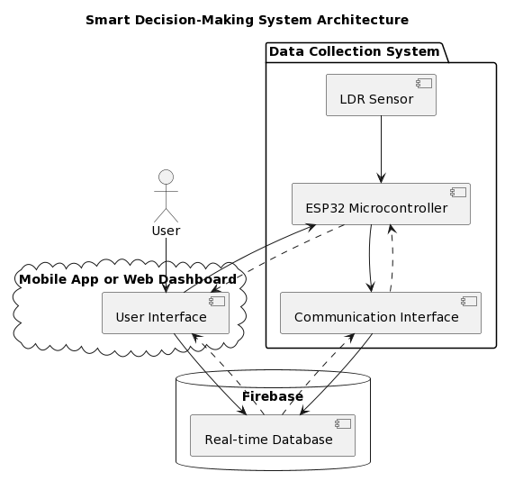
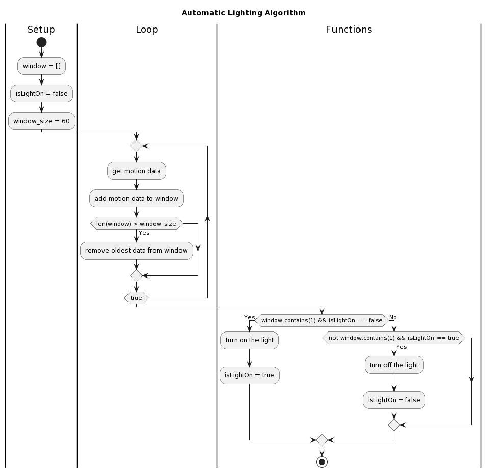

# ESP32 Light Sensor

This project demonstrates the usage of an ESP32 microcontroller to read data from a light sensor and control an LED based on the detected light intensity.

## Project structure

The project is generally structured as follows:
```
root/
├─ pj.ino
├─ README.md
├─ TaQuangHieu-M22ICT002-project (1).docx
```
The text docx is the detail report for the project. The png image are image to be represented in the README file

## Code

```cpp
#define LIGHT_SENSOR_PIN 36 // ESP32 pin GPIO36 (ADC0)
#include <stdbool.h>

bool isLightOn = false;
int window[10];

void setup() {
  // initialize serial communication at 9600 bits per second:
  Serial.begin(9600);
  pinMode(LIGHT_SENSOR_PIN, INPUT_PULLUP);
  pinMode(LED_BUILTIN, OUTPUT);
}

void loop() {
  // reads the input on analog pin (value between 0 and 4095)
  int analogValue = analogRead(LIGHT_SENSOR_PIN);

  Serial.print("Analog Value = ");
  Serial.print(analogValue);   // the raw analog reading

  // We'll have a few thresholds, qualitatively determined
  if (analogValue < 500) {
    Serial.println(" => Light");
    // Shift the window to the right
    for (int i = 10 - 1; i > 0; i--) {
        window[i] = window[i - 1];
    }
    window[0] = 1;
  }  else {
    Serial.println(" => Dark");
    // Shift the window to the right
    for (int i = 10 - 1; i > 0; i--) {
        window[i] = window[i - 1];
    }
    window[0] = 0;
  }

  if (containsMotion() && isLightOn == false) {
    digitalWrite(LED_BUILTIN, HIGH);
    isLightOn = true;
  } else {
    digitalWrite(LED_BUILTIN, LOW);
    isLightOn = false;
  }

  for (int i = 0; i < 10; i++) {
    Serial.print(window[i]);
    if (i==9){
      Serial.println(window[i]);
    }
  }

  delay(1000);
}

bool containsMotion() {
  // Check if window contains any motion data
  for (int i = 0; i < 10; i++) {
    if (window[i] == 1) {
      return true; // If motion data is found, return true
    }
  }
  return false; // If no motion data is found, return false
}
```
## Usage
To use this code, you need an ESP32 microcontroller and a light sensor connected to it according to the wiring diagram provided on esp32io.com. Once you have set up the hardware, you can upload the code to the ESP32 using the Arduino IDE or any other suitable development environment.

The code reads the analog input from the light sensor and determines whether the detected light intensity is below a certain threshold. Based on this determination, it shifts a window of motion data and checks if there is any motion detected in the window. If motion is detected and the light is currently off, it turns on the built-in LED on the ESP32.

Feel free to modify the code according to your requirements and experiment with different thresholds and actions based on the light sensor data.

## Diagram

Below is the sequence diagram that show how does the component interact with each other:

And this is the diagram shows how does the algorithm works:

