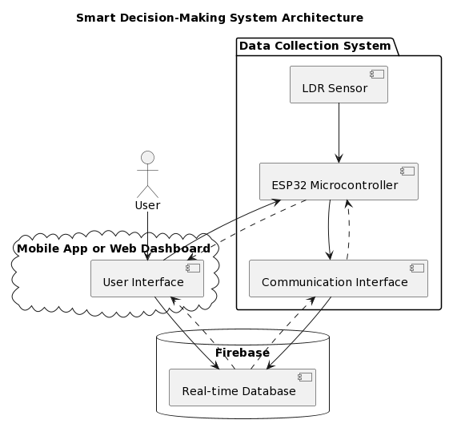
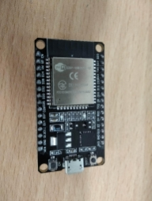
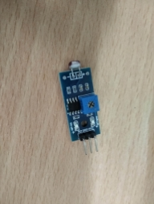

# UNIVERSITY OF SCIENCE AND TECHNOLOGY OF HANOI

## PROJECT REPORT

### By

Ta Quang Hieu - M22ICT002

Master of Data Science

## Title:

 **Automatic Light-Checking System**

Hanoi, April 2023

# 
# Table of content

[**1. Introduction:**	](#_dvdl1i7caxwx)**3****

[• Describe the smart decision-making model's purpose and real-world applications, and explain the system's requirements and functionalities.	](#_pxkweg241r70)3

[• Explain the importance of effectively collecting and processing data from sensors in the context of the course.	](#_n0x2wlxuem2b)4

[**2. System Components and Architecture:**	](#_pdp6gn6dtmo6)**4**

[• Identify and describe the main components of the smart decision making system.	](#_pby8nru1gz0v)5

[• Design the system architecture using a diagram to show the relationship between components and how they interact.	](#_6kdg2svce0n9)6

[• Present the diagram using PlantUML code to describe the system.	](#_k1ged71uyjse)7

[**3. Implementation Details:**	](#_k7xxpo8bobo)**8**

[• Explanation of sensor selection and their specific roles in the system.	](#_chz9r689ptj1)8

[• Describe the data processing techniques used to make informed decisions based on the collected data.	](#_3onli6mozhhq)10

[• Discuss communication protocols and technologies related to data transmission between components.	](#_zhb89v3suruy)11

[**4. Testing and Validation (if applicable):**	](#_cyk5k8n2svc7)**11**

[**5. Conclusion**	](#_rvbtuew7ycvt)**12**

[• Evaluate the designed system's overall effectiveness in meeting real-world applications' needs.	](#_dae926khl7ob)13

[• Comment on the advantages, limitations, and scalability of the system.	](#_ktgn27xo8mrg)13

[• Propose improvements and further development for the system in the future.	](#_g3uf3p6lddez)14

# 
# 1. Introduction:
In this part we will give the introduction of the system for detecting change in light intensity with the application of it in the real world and also explain the importance for processing the data.
## • Describe the smart decision-making model's purpose and real-world applications, and explain the system's requirements and functionalities.
The reason for the smart decision-making model using a light sensor framework with ESP32 and LDR (Light Dependent Resistor) sensor is to automate the method of checking whether lights are turned off in each room of a college at night utilising the LDR sensor. The model employs real-time data taken from the LDR sensor to decide if the lights are on or off and creates notices or cautions for rooms where lights are found to be left on, eliminating the requirement for manual checking.

Real-world applications of this smart decision-making model is to incorporate college campuses, schools, office buildings, or any huge office with numerous rooms where energy preservation and proficient lighting are important. For example, the system can check for the light levels in each room utilising the LDR sensor and send notices to the college gatekeeper or support staff when lights are found to be left on, showing that a room needs attention. This could save time and effort for the gatekeeper, as they don't have to manually visit each room to check the lights, and can focus on areas that require consideration based on real-time information from the LDR sensor.

The functionalities of the model would be reading and processing information from the LDR sensor in real-time, deciding in the event that lights are on or off based on predefined threshold values, and sending notices or alarms when lights are found to be left on. The model ought to be able to handle different rooms and give room-wise status data to the gatekeeper. It should also have the capability to schedule or disable the checking handle during certain time periods, such as when the lights are intentionally kept on for particular occasions or activities. Furthermore, It should be configurable and adaptable to diverse room layouts, lighting necessities, and inclinations of the college.

This smart system would require an ESP32 microcontroller, an LDR sensor, and appropriate algorithms for data handling, decision-making, and control. The processing power and memory of the ESP32 microcontroller should be satisfactory to execute the decision-making model and communicate with the LDR sensor. The LDR sensor ought to be able to observe the ambient light levels within the environment precisely. The algorithms should be created to handle sensor data, make intelligent lighting control choices based on predetermined algorithms, and communicate with the lighting control system to modify lighting levels as required.

The smart decision-making model would have the following features:

- The LDR sensor is used to identify and measure encompassing light levels.
- The sensor data is processed and examined to set up the optimal lighting levels based on predetermined rules or machine learning algorithms.
- Based on the assessed sensor data, making real-time lighting control choices, such as altering the brightness or colour temperature of the lights.
- Communicating with lighting control systems, such as dimmers or savvy bulbs, to adjust light levels as required.
- Persistently observing and altering to changing environmental circumstances in order to improve lighting control for energy effectiveness and consolation.

## • Explain the importance of effectively collecting and processing data from sensors in the context of the course.

In the framework of the course "From sensor to user," good sensor data collection and processing is critical for various reasons:

- Data correctness and reliability: The accuracy and reliability of the information taken from the data are specifically influenced by the quality of data collected from sensors. Sensors are utilised to gather real-world measures such as temperature, humidity, pressure, or motion, which are critical for an assortment of applications such as natural monitoring, healthcare, smart homes, and mechanical automation. It is critical to guarantee that data is collected and dealt with successfully in order to procure valuable insights and make informed choices.
- Data integrity and consistency: Sensor data can be prone to a variety of problems, including noise, drift, and outliers. To preserve data integrity and consistency, effective data collecting and processing techniques such as filtering, calibration, and error correction are required. Clean and trustworthy data is essential for producing accurate and trustworthy results and avoiding misleading conclusions.
- Data scalability and efficiency: As the amount of data increases, scalability and efficiency of data processing become crucial. Efficient data collection techniques, for example data aggregation, compression, and sampling, can help limit the load of data that needs to be transmitted or recorded, so that preserving bandwidth and storage space.
- Real-time speed and processing: Most sensor data applications, such as environmental monitoring, traffic management and industrial automation, require real-time data processing to make informed decisions. To quickly and reliably deliver insights from sensor data, efficient data collection and processing methods are needed that can process real-time data streams, merge data, and analyse data
- Data security and privacy: Sensitive information, for example: Personal, financial, or proprietary information can repeatedly be captured in sensor data. To manage data privacy and security, effective data collection and processing requisite include strong security features such as data encryption, access restriction, and data anonymization. Ensuring data security and privacy is important to meet data protection standards and gain user trust and reputation. 
# 2. System Components and Architecture:
This part will show the component needed to make the system introduced above along with the diagram showing the interaction of the component and then the algorithm to make a decision.
## • Identify and describe the main components of the smart decision making system.
Based on the additional information that the communication in the light sensor system is done through Firebase, the main components of the smart decision-making system can be identified and described as follows:

- ESP32 Microcontroller: This is the control unit of the system that is composed of the LDR light sensor and other components. It is responsible for collecting data from the sensor, processing it, communicating with Firebase, and controlling other system components.
- LDR Light Sensor: This is the component that measures the light intensity and sends analog data to the ESP32 microcontroller for further processing.
- Firebase: This is a cloud-based real-time database and communication platform allowing for storing, retrieving, and synchronising data between devices in real-time. In this system, Firebase is used for communication and data exchange between the ESP32 microcontroller and the  mobile app or a web-based dashboard.
- Mobile App or Web Dashboard: This allows users to interact with the system, and make decisions. The mobile app or web dashboard communicates with Firebase to send or receive data and then commands to or from the ESP32 microcontroller.
- Decision-Making Algorithm: This is the part that processes the collected data from the sensor and makes decisions based on the algorithms. The decision-making algorithm runs on the ESP32 microcontroller.
- Communication Interface: This component facilitates the communication between the ESP32 microcontroller and Firebase, allowing for data exchange and synchronisation in real-time.

These are the main components of the smart decision-making system for the light sensor system using an ESP32 microcontroller and an LDR light sensor with communication through Firebase. The specific functionalities, interactions, and requirements of each component may vary depending on the system design and implementation approach.
## • Design the system architecture using a diagram to show the relationship between components and how they interact.

All the components are stated in the previous part and this diagram will show the interaction between components: The user will use the Mobile app or the Web Dashboard to interact with the system (get analytic or receive notification). In the diagram, the dash-arrow shows the read action while the normal arrow shows the write action. As visualised above, we can see that all the components are strongly connected with write and read action, except for the sensor which is only responsible for the write action to send back the data of the environment to the controller for further analysis.
## • Present the diagram using PlantUML code to describe the system.

This is the diagram shown for the algorithm used for control the led of esp32, that will be discuss below with the used of the window:

start

:window = [];

:isLightOn = false;

:window\_size = 60;

|Loop|

repeat

:get motion data;

:add motion data to window;

if (len(window) > window\_size) then (Yes)

:remove oldest data from window;

endif

repeat while (true)

|Functions|

if (window.contains(1) && isLightOn == false) then (Yes)

:turn on the light;

:isLightOn = true;

else (No)

if (not window.contains(1) && isLightOn == true) then (Yes)

:turn off the light;

:isLightOn = false;

endif

endif

stop
# 3. Implementation Details:
Having the design and the components needed in the previous part, in this part we will choose the sensor with specification needed for the purpose of detecting light intensity in the classroom, show the data processing technique used and finally discuss about the communication protocol used to connect all the components together.
## • Explanation of sensor selection and their specific roles in the system.
a. This is the sensor that I used in this project:

LDR light sensor (measuring range from 0 to 10,000 lux, accuracy ±2%, resolution 0.1 lux):

The LDR light sensor module could be a sort of sensor used to measure the ambient light concentrated within the encompassing environment. Here are a few particular technical specifications and a clarification of why these parameter values are utilised for the purpose of light sensing in a classroom as an elective to manually checking and turning off lights in each room.

Output:

- Output voltage: From approximately 0V to 5V
- Output current: From approximately 0mA to 20mA

The reason for employing a light sensor with an output voltage extending from 0V to 5V and an output current extending from 0mA to 20mA is to supply an output signal that's congruous with prevalent microcontrollers and electronic modules, such as Arduino or ESP32, making it simple to integrate and control the sensor in a project.

Measures range from to 10,000 lux:

Classrooms ordinarily have changing light levels depending on factors such as natural light coming from windows, fake lighting, and time of day. By having a wide measuring range of to 10,000 lux, the light sensor can effectively capture changes in light levels within the classroom environment, extending from low light levels during cloudy days or evenings to brighter light levels during sunny days or when all lights are turned on within the classroom.

Accuracy ±2%:

Accuracy is important in a classroom setting to guarantee reliable location of light nearness. A ±2 accuracy implies that the sensor's estimations are inside 2% of the genuine light levels, which gives a sensible level of exactness for identifying changes in light presence. This accuracy permits the sensor to supply reliable and consistent results, which are important for activating automated activities or alarms based on changes in light levels within the classroom.

Resolution 0.1 lux:

A resolution of 0.1 lux implies that the sensor can identify indeed little changes in light levels with high affectability. In a classroom setting, where subtle changes in light presence, such as when a projector is turned on or off, or when lights are darkened, ought to be captured, a determination of 0.1 lux can give the vital affectability to precisely identify such changes.

Within the system architecture diagram, the LDR (Light Dependent Resistor) sensor is an vital component that plays a particular part within the overall functioning of the smart decision-making system.

b. Here's an clarification of the LDR sensor choice and its particular roles within the system:

- LDR Sensor: The LDR sensor is used to measure the ambient light level within the environment. It acts as a sensor that recognizes changes in light intensity and gives input to the ESP32 microcontroller. The LDR sensor is associated with the communication interface of the ESP32 microcontroller, which permits it to send the measured light intensity information to other components of the system for assist processing.
- Data Source: The LDR sensor acts as the essential data source for the system. It provides information around the current light intensity within the environment, which could be a critical input for the decision-making algorithm. The decision-making algorithm employs this data to make choices based on predefined rules or logic, such as altering the brightness of lights or screens, sending notifications, or activating other activities.
- Trigger for Decision-Making: The LDR sensor triggers the decision-making process within the system. It continuously monitors the surrounding light level and sends the measured data to the decision-making algorithm through the communication interface. Based on the received data, the decision-making algorithm processes the information and makes choices appropriately. For example, in case the light escalated is underneath a certain edge, the calculation may trigger activities to turn on lights or increment screen brightness, whereas on the off chance that the light intensity is over a certain threshold, it may trigger activities to turn off lights or diminish screen brightness.
- Real-time Information Input: The LDR sensor gives real-time data input to the system. As the light intensity changes, the sensor captures these changes and sends the data to the decision-making algorithm in real-time allowing the system to respond and make choices based on the current light conditions, providing real-time responsiveness and adaptability to changing natural conditions.
- Connectivity: The LDR sensor is connected to the ESP32 microcontroller, which gives it the ability  to communicate with other components of the system. This connectivity allows the system to get and prepare the light intensity data from the LDR sensor and take appropriate activities based on the received data.
## • Describe the data processing techniques used to make informed decisions based on the collected data.
The data processing techniques utilised within the described system for making informed choices based on the collected data include windowing, data sampling, thresholding, and Led control. Here is an overview of the steps included:

Windowing: We defined a window of 60 components to store the collected data from the sensor. The window acts as a buffer that can hold the foremost recent 60 samples of data.

Data Sampling: After each second, a sample is taken from the sensor. In case the sensor data indicates an activity (e.g., an occasion or trigger), the value 1 is included in the window, showing the occurrence of the activity. Otherwise, a value of 0 is included in the window, demonstrating the absence of the activity.

Window Overflow Handling: When the window already contains 60 components, the oldest component within the window is expelled before including the latest data. This guarantees that the window continuously maintains a fixed estimate of 60 components and holds the foremost recent information.

Making decision: A function is implemented to check in case there's at least one value 1 in the window. In case there's , it shows that an activity has happened at least once within the past 60 seconds, and the system can make an informed decision based on this information.

Led Control: In the event that the thresholding function recognizes the presence of at least one 1 within the window, it triggers the ESP32 microcontroller to control the Led, causing it to flicker as a sign of the occurrence of the activity.

It's imperative to note that this is often a basic information handling procedure based on windowing and Driven control as portrayed within the given situation. Depending on the particular prerequisites and complexity of the framework, extra information handling strategies such as statistical investigation, machine learning calculations, or other decision-making procedures may be required for more advanced and exact decision-making based on the collected information.
## • Discuss communication protocols and technologies related to data transmission between components.
The system architecture diagram shows that in the system we have an LDR sensor, communication interface, ESP32 microcontroller, Firebase real-time database, portable app or web dashboard as user interface, and a user.

The communication protocols and technologies related to data transmission between components in this system may incorporate:

- Analog Input/Output (GPIO): The ESP32 microcontroller communicates with the LDR sensor utilising analog input/output (GPIO) pins to receive the analog voltage output from the sensor and control the sensor's operation.
- Wi-Fi or Ethernet: The system may utilise Wi-Fi or Ethernet communication protocols to put through the ESP32 microcontroller to the Firebase real-time database and the mobile app or web dashboard user interface. This empowers real-time information transmission and synchronisation between the framework and the database or user interface.
- Firebase Real-time Database: The Firebase real-time database gives a cloud-based database service that empowers real-time data synchronisation between the ESP32 microcontroller and the mobile app or web dashboard user interface.
- Mobile App or Web Dashboard: The mobile app or web dashboard serves as the user interface for interacting with the framework. Data transmission between the user interface and the ESP32 microcontroller may include utilising APIs or protocols such as HTTP, MQTT, or WebSocket for sending and getting data for observing and controlling the system.
- User Interaction: The user interatomic with the system through the mobile app or web dashboard, and the system may utilise communication protocols such as HTTP, MQTT, or WebSocket to get client inputs and transmit commands to the ESP32 microcontroller for controlling the system or updating the real-time database.

In general, the communication protocols and technologies utilised are fundamental for empowering data transmission and communication between the diverse components, permitting for real-time monitoring, control, and decision-making within the smart decision-making system.
# 4. Testing and Validation (if applicable):
After choosing the component and doing the processing state, now we will come to the reality, testing all the parts using real components and in the scenario of room condition.

This is the equipments that I used for this project:

|esp32|Light sensor|
| :-: | :-: |
|||

  
For the connection, in the light sensor there are 3 pins: DO (data output), GND (ground) and VCC (power supply). Consequently, they will be connected to esp32 with the order: VCC is connected to 3V3 pin of esp32, GND is connected to GND of esp32 and finally the pin DO is connected to VP (which is the GPIO36).

For this project I am only able to do the offline part and haven’t been able to do the User Interface along with the connection to Firebase database. For some reason, when doing the experiment the system still working fine but then when testing after several days later, it got some weird error that I still haven’t been able to deal with (I cannot determine that where do the error come from, the hardware or the software in order to debug the system) 

The experiment is show in the link below:

|[Experiments videos](https://drive.google.com/file/d/1lRToe7YTHWUWB6r1Ir-H4hHG45-Z2bqk/view?usp=sharing)|

# 5. Conclusion
After all the implementation, now we will come to the conclusion and make discussion from what we have done.
## • Evaluate the designed system's overall effectiveness in meeting real-world applications' needs.
Based on the given architecture and automatic lighting algorithm, the system has the potential to be successful in the assembly desires of the college gatekeeper for checking if the lights within the rooms are off or not. Here are a few thing to consider:

- Communication Interface: The system employs a communication interface to associate the LDR sensor and the ESP32 microcontroller, as well as the real-time database and the user interface. The adequacy of the communication interface would depend on its reliability and effectiveness in transmitting the sensor data to the microcontroller and the real-time database, as well as getting commands from the user interface.
- Automatic Lighting Algorithm: Based on the given pseudocode, we employ a window-based approach to identify movement data and make decisions. The algorithm depends on the presumption that presence of movement demonstrates the decision to turn on or off the light. Be that as it may, this may not always be exact, as there may be scenarios where lights have to be be kept on indeed in the event that there's no movement (e.g., during a presentation or a scheduled occasion), or lights ought to be turned off indeed in the event that there's motion (e.g., amid daytime). The algorithm's viability would depend on the particular requirements and scenarios of the university's lighting control needs.
- User Interface: The system gives a user interface through a mobile app or web dashboard, which permits the college gatekeeper to monitor and control the lighting system. The adequacy of the user interface would depend on its usability, accessibility, and functionality. It gives real-time and precise data about the status of lights in different rooms, and permits the gatekeeper to effortlessly control the lights based on their needs.
- Reliability and Security: The system ought to be reliable and secure to guarantee that it works consistently and ensures the privacy and security of the university's data. Proper error handling, fault tolerance, and security measures ought to be in put to ensure the system's reliable operation in real-world scenarios.

## • Comment on the advantages, limitations, and scalability of the system.
Advantages of the system:

- Automation: The system uses an automatic lighting algorithm that can automatically turn lights on or off based on motion detection, which can save energy by ensuring that lights are only used when needed, and reduce the burden of manual control for the university gatekeeper.
- Real-time monitoring and control: The system provides a user interface through a mobile app or web dashboard, allowing the university guardian to monitor and control the lights in real-time, providing convenience and flexibility in managing the lighting system.
- Data collection and analysis: The system collects data from the sensor and stores it in a real-time database, which can be used for data analysis and insights on lighting usage patterns, helping the university guardian to make informed decisions for optimising lighting control and energy management.
- Scalability: The system architecture, with a communication interface and a real-time database, provides potential for scalability, allowing for integration with other sensors or devices, and expansion to control lights in multiple rooms or buildings within the university campus.

Limitations of the system:

- Accuracy of motion detection: The system relies on the accuracy of the sensor in detecting motion, which may be affected by environmental factors such as lighting conditions, sensor placement, and sensor sensitivity. Inaccurate motion detection may result in incorrect lighting control decisions.
- Dependency on sensor data: The system's automatic lighting algorithm is based exclusively on movement discovery data from the LDR sensor, which may not continuously accurately reflect the lighting needs within the rooms. For illustration, there may be scenarios where lights have to be kept on indeed in case there's no movement, or lights ought to be turned off even if there's movement. This may result in problematic lighting control in certain circumstances.
- Limited flexibility in algorithm: The system's automatic lighting algorithm, as per the given pseudocode, is simplistic and may not be suitable for all scenarios or lighting control requirements. Customization or modification of the algorithm may be needed to adapt to specific needs of the university or changing requirements over time.
- Scalability of the system: The system's scalability would depend on the flexibility of the system architecture and its ability to handle increasing complexity and scale of operations.

Some factors to consider for scalability include:

- Sensor integration: The system should be able to easily integrate with different types of sensors, beyond just the LDR sensor, to cater to diverse lighting control requirements or expand to control lights in multiple rooms or buildings.
- Communication interface: The communication interface should be able to handle increasing data volume and communication load as the system scales up, without compromising on reliability and efficiency.
- Database capacity: The real-time database should have sufficient capacity to store and process data from multiple sensors or devices, and support real-time data updates and retrieval, as the system expands.
- User interface scalability: The user interface ought to be adaptable to suit expanding users, gadgets, and functionalities, and give a consistent involvement for observing and controlling the lighting system.
- System performance and reliability: The system ought to be planned to handle expanding load and complexity, and ought to be reliable and fault-tolerant to guarantee smooth operation as it scales up.
## • Propose improvements and further development for the system in the future.
These are some potential improvements and further developments that could be considered for the light sensor system in a classroom:

- Machine Learning Techniques: Incorporating machine learning techniques, such as supervised or unsupervised learning algorithms, can enhance the system's ability to accurately detect patterns and anomalies in the light sensor data. For example, machine learning algorithms could learn from historical data to automatically adapt and optimise the threshold values or duration for turning off lights based on changing classroom dynamics, weather conditions, or other factors.
- Mobile App or Web Interface: Developing a mobile app or web interface and connecting to a firebase database for the system can provide the guardian or other stakeholders with remote access and control over the lighting system. This can enable real-time monitoring of the sensor data, remote configuration of threshold values or duration, and receiving notifications or alerts on the status of the lights, enhancing convenience and ease of use.
- Multi-sensor Integration: Coordination extra sensors, such as occupancy sensors, temperature sensors, or movement sensors, can give more context and data for decision-making. For occasion, combining light sensor data with inhabitants sensor data can offer assistance to decide on the off chance that the lights have to be turned off based on both light concentrated and occupancy levels within the classroom. This will result in more intelligent and fine-grained control of the lighting system.
- Data Analytics and Reporting: Growing the data analytics and announcing capabilities of the system can give more in-depth insights into the system's execution, counting trends, patterns, and anomalies in the sensor data. This can support data-driven decision-making and encourage progressing optimization of the system.
- Continuous Improvement and Maintenance: Regularly evaluating and maintaining the system's execution, addressing any issues or limitations, and consolidating input from users can guarantee that the system remains effective and efficient over time. Continuous improvement and maintenance efforts can also include software updates, sensor calibrations, and system optimizations to ensure optimal performance.

These are just a few potential improvements and further developments that could be considered for the light sensor system in the future since we just built a very simple model so there are many rooms for modification and improvement of the system.
